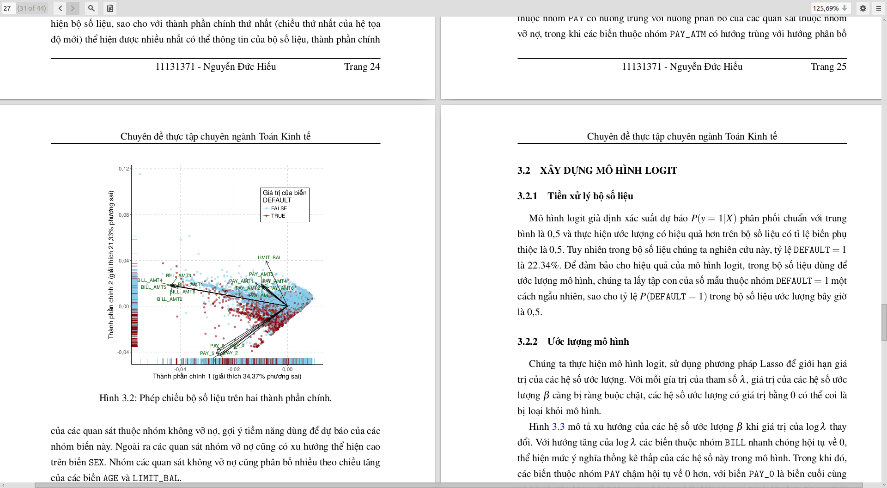

# tkthesis

LaTeX Class cho đề tài luận văn theo yêu cầu của khoa Toán Kinh Tế - Đại học Kinh tế Quốc dân: [link](http://mfe.edu.vn/tin-tuc/quy-dinh-ve-chuyen-de-thuc-tap-bac-dai-hoc.html "link")

## Các package yêu cầu

- `scrextend`
- `vietnam`
- `verbatim`
- `listings`
- `afterpage`
- `xcolor`
- `graphicx`
- `enumitem`
- `indentfirst`
- `etoolbox`
- `fancyhdr`
- `titlesec`
- `titletoc`
- `graphicx`
- `placeins`
- `caption`
- `hyperref`
- `hypcap`
- `biblatex`

## Chú ý
Class này chỉ dùng cho phiên bản `LaTeX2e` và ưu tiên render bằng `pdflatex`.

Để sử dụng, thêm file `tkthesis.cls` vào cùng thư mục với file `.tex`, `.rnw` hoặc `.rmd` của bạn và gọi class vào đầu file đó:

> \documentclass{tkthesis}

Chú ý không dùng 2 lần `\documentclass` và không gọi lại các package liệt kê ở trên với `\usepackage`
